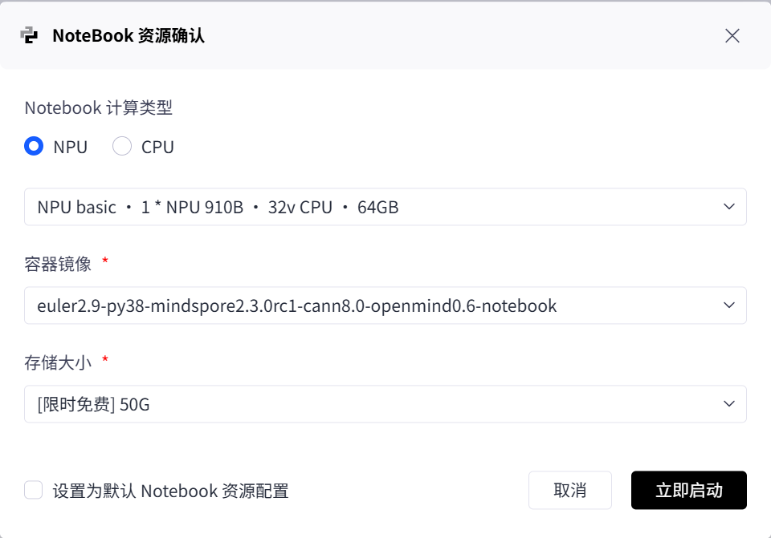

### Llama-3-8B 指令微调（基于MindSpeed-LLM）
自行车的视觉语言导航（VLN）功能基于NaVILA方法实现，算法核心为支持思维链（CoT）的Llama-3-8B模型。
本部分基于MindSpeed-LLM与Megatron-core，在一块910B NPU上对Llama-3-8B进行指令微调，从而使其适应思维链模式，便于后续导航任务优化。
#### 数据准备
```bash
git clone https://gitcode.com/Ascend/MindSpeed-LLM.git
cd MindSpeed-LLM
mkdir -p dataset && cd dataset
wget https://huggingface.co/datasets/QingyiSi/Alpaca-CoT/resolve/main/data/train-00000-of-00001.parquet
cd ..
```
目标目录（示例）:
```
MindSpeed-LLM/
	├─ model_from_hf/           # HF 原始模型权重 & tokenizer
	│   └─ llama3_hf/           # 从 HF 下载的 Meta-Llama-3-8B 文件夹
	├─ dataset/
	│   └─ train-00000-of-00001.parquet
	├─ finetune_dataset/        # 预处理输出（脚本生成）
	└─ examples/mcore/llama3/   # 官方示例脚本
```

#### 模型权重获取 (HuggingFace)

登录 HuggingFace 通过 `git lfs` 下载 `meta-llama/Meta-Llama-3-8B`：
```bash
mkdir -p model_from_hf/llama3_hf
cd model_from_hf/llama3_hf
git lfs install
git clone https://huggingface.co/meta-llama/Meta-Llama-3-8B .
cd ../..
```
完整文件列表示例：
```
config.json
generation_config.json
tokenizer.json
tokenizer_config.json
model.safetensors.index.json
model-00001-of-0000X.safetensors  # 分片权重
...
```

#### HF → Megatron (MindSpeed) 权重转换
```bash
# 修改 ascend-toolkit 路径
source /usr/local/Ascend/ascend-toolkit/set_env.sh
export CUDA_DEVICE_MAX_CONNECTIONS=1

# 权重格式转换（HF -> Megatron）
python convert_ckpt.py \
	--use-mcore-models \
	--model-type-hf llama2 \
	--model-type GPT \
	--load-model-type hf \
	--save-model-type mg \
	--params-dtype bf16 \
	--target-tensor-parallel-size 8 \
	--target-pipeline-parallel-size 1 \
	--load-dir ./model_from_hf/llama3_hf/ \
	--save-dir ./model_weights/llama3_mcore/ \
	--tokenizer-model ./model_from_hf/llama3_hf/tokenizer.json   # 可按需添加 --num-layer-list 17,20,22,21 等
```
说明：
- `--target-tensor-parallel-size/--target-pipeline-parallel-size` 与后续训练的并行度保持一致（示例为 TP=8, PP=1）。
- 转换完成后权重输出在 `./model_weights/llama3_mcore/`，微调脚本用 `CKPT_LOAD_DIR` 指向该目录即可。

#### 数据预处理 (Alpaca-CoT 格式)
```bash
source /usr/local/Ascend/ascend-toolkit/set_env.sh
python preprocess_data.py \
	--input ./dataset/train-00000-of-00001.parquet \
	--tokenizer-name-or-path ./model_from_hf/llama3_hf \
	--output-prefix ./finetune_dataset/llama3_alpaca_cot \
	--workers 8 \
	--log-interval 1000 \
	--tokenizer-type PretrainedFromHF \
	--handler-name AlpacaStyleInstructionHandler \
	--prompt-type llama3 \
	--enable-thinking true \
	--map-keys '{"prompt":"instruction","query":"input","response":"output"}'
```
生成文件示例：
```
finetune_dataset/llama3_alpaca_cot_packed_input_ids_document.bin
finetune_dataset/llama3_alpaca_cot_packed_labels_document.bin
...
```
微调时只需传前缀：`./finetune_dataset/llama3_alpaca_cot`。

#### 微调脚本配置
创建或修改脚本：`examples/mcore/llama3/tune_llama3_8b_full_ptd.sh`
环境与并行：
```bash
NPUS_PER_NODE=1
MASTER_ADDR=localhost
MASTER_PORT=6000
NNODES=1
NODE_RANK=0
WORLD_SIZE=$(($NPUS_PER_NODE * $NNODES))

TP=1   # 与转换保持一致
PP=4
SEQ_LEN=4096   # 可按需要设定，确保满足上下文长度需求
```
路径参数：
```bash
CKPT_LOAD_DIR=./model_weights/llama3_mcore           # 转换后模型
CKPT_SAVE_DIR=./output/llama3_finetune_ckpt           # 保存微调结果
DATA_PATH=./finetune_dataset/llama3_alpaca_cot        # 数据前缀
TOKENIZER_PATH=./model_from_hf/llama3_hf
```
关键训练参数：
```bash
GLOBAL_BATCH_SIZE=512          # = micro_batch * grad_acc * WORLD_SIZE
MICRO_BATCH_SIZE=4             # 单设备微批大小
GRAD_ACCUM_STEPS=16            # 梯度累积步数
LR=2e-5                        # 全参数指令微调常用低学习率
MIN_LR=2e-6                    # 余弦退火最终学习率
WEIGHT_DECAY=0.1
WARMUP_RATIO=0.03
TRAIN_ITERS=5000               # 或按 epoch / tokens 计算
LOG_INTERVAL=20
EVAL_INTERVAL=500
SAVE_INTERVAL=1000
```
指令数据相关开关：
```bash
--is-instruction-dataset \
--no-pad-to-seq-lengths            # 动态序列提升 sample 吞吐（可选） \
--pad-to-multiple-of 8             # 动态 padding 对齐倍数 \
--reset-attention-mask             # 若使用 packed 样本拼接视情况添加
```
启动：
```bash
bash examples/mcore/llama3/tune_llama3_8b_full_ptd.sh
```
训练环境：


#### 推理验证
使用生成脚本：`examples/mcore/llama3/generate_llama3_8b_ptd.sh`：
```bash
CKPT_DIR=./output/llama3_finetune_ckpt
TOKENIZER_PATH=./model_from_hf/llama3_hf
python generate.py \
	--ckpt-dir ${CKPT_DIR} \
	--tokenizer ${TOKENIZER_PATH} \
	--prompt "解释强化学习的基本原理，并给出一个简单例子" \
	--max-new-tokens 512 \
	--temperature 0.7 \
	--top_p 0.9
```

#### Megatron (MindSpeed) → HF 权重转换
```bash
source /usr/local/Ascend/ascend-toolkit/set_env.sh
export CUDA_DEVICE_MAX_CONNECTIONS=1

python convert_ckpt.py \
	--use-mcore-models \
	--model-type-hf llama2 \
	--model-type GPT \
	--load-model-type mg \
	--save-model-type hf \
	--target-tensor-parallel-size 1 \
	--target-pipeline-parallel-size 1 \
	--load-dir ./model_weights/llama3_mcore/ \
	--save-dir ./model_from_hf/llama3_hf/  # 新权重将保存到 ./model_from_hf/llama3_hf/mg2hg/
```
- `--load-dir`：指向 Megatron/MindSpeed 训练输出或转换后的权重目录。
- `--save-dir`：指向原始 HF 模型目录；转换后会在该目录下生成 `mg2hg/` 子目录，包含可由 `transformers` 直接加载的权重与配置。

#### NaVILA方法部署
请参考https://github.com/AnjieCheng/NaVILA
